# Teris Su7 Max by mimimiHoYo

## **第一次问题及改进方向**

游玩过程中发现有几点可以修改的部分：

（1）单人玩家控制时默认是↑↓←→来控制，但是双人的时候左边要求用WSAD控制，右边用↑↓←→控制.

（2）首页增加设置按钮，设置里可以选择背景音乐（本地加载）和难度调换和分辨率选择

（3）双人对战中若分数相同则显示平局，若一方获胜则显示 `Player1 or Player2 Win`

（4）要求ESC是返回上一个界面，比如说我在单人关卡，按ESC不是直接退出游戏，而是返回到首页

（5）将确认键换成Enter而不是Space，并且支持鼠标点击操作

（6）增加一个开屏动画，然后游戏名字叫 `Tetris Su7 Max by mimimiHoYo`

**1.具体更改地点**

例如

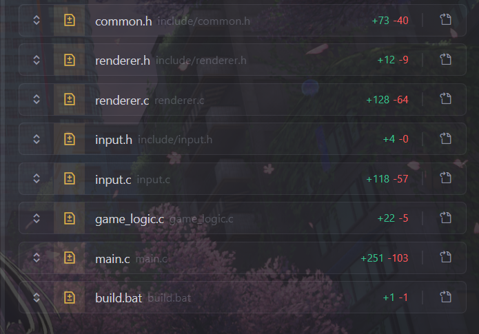

**2.修改成果**

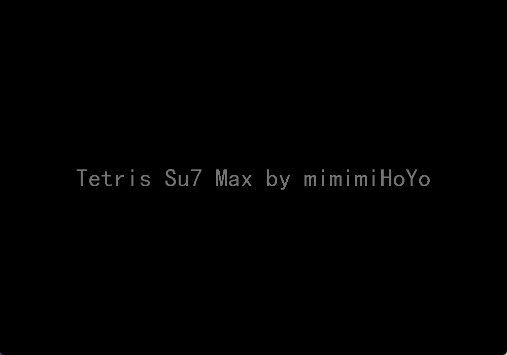

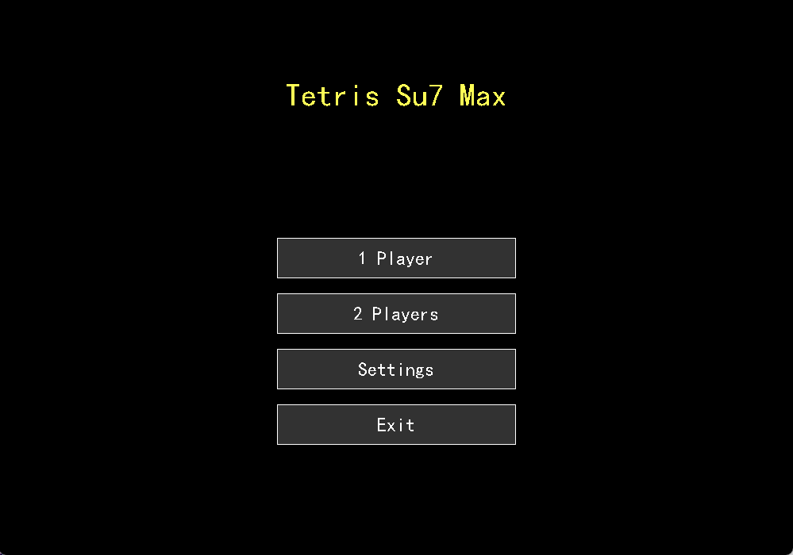

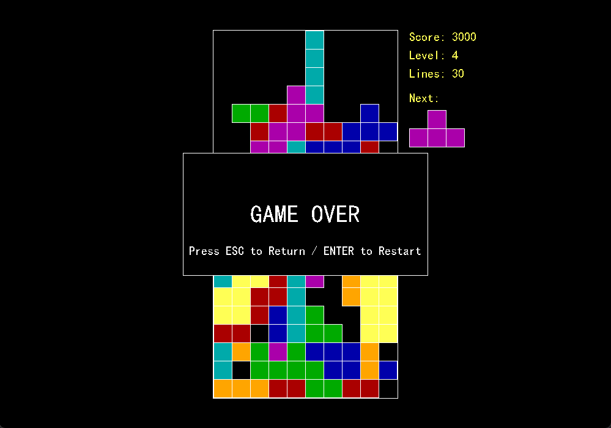

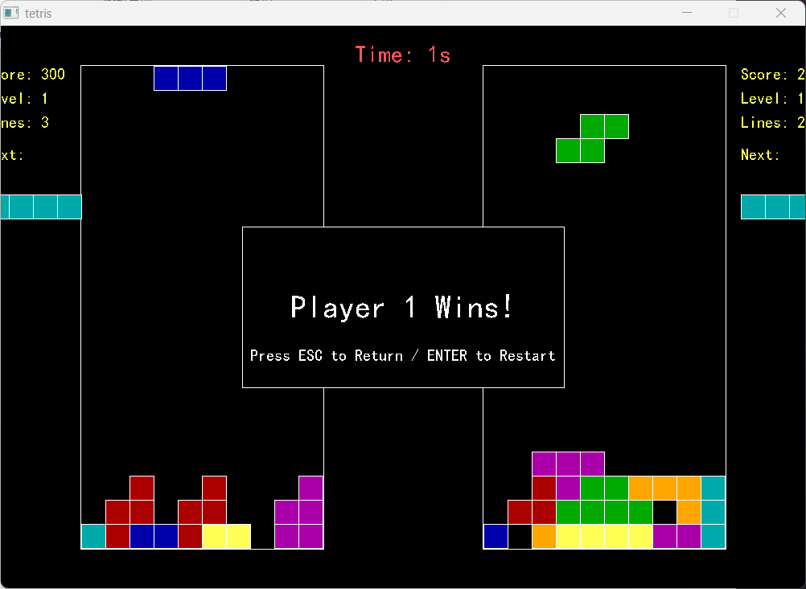

## 第二次问题及改进方向

前一次规划中我们提出了几个问题：

（1）.单人玩家控制时默认是↑↓←→来控制，但是双人的时候左边要求用WSAD控制，右边用↑↓←→控制.

（2）首页增加设置按钮，设置里可以选择背景音乐（本地加载）和难度调换和分辨率选择

（3）双人对战中若分数相同则显示平局，若一方获胜则显示 `Player1 or Player2 Win`

（4）要求ESC是返回上一个界面，比如说我在单人关卡，按ESC不是直接退出游戏，而是返回到首页

（5）将确认键换成Enter而不是Space，并且支持鼠标点击操作

（6）可以增加一个开屏动画，然后游戏名字叫 `Tetris Su7 Max by mimimiHoYo`

其中(1)(3)(4)(5)(6)我们已经成功解决，但是(2)虽然我们添加了按钮，但是我还只是增加了一个ON/OFF的切换按钮，实际上没有添加真正的背景音乐，结合需求来看，我们第二阶段应该实现以下目标：

- 音乐可以选择从本地导入路径进行播放
- 允许添加首页/游戏中的背景图案，并支持自己调节不透明度
- 在首页增加个人排行榜，以显示个人历史的最高纪录
- 在双人对战时，通过Space按钮实现暂停和继续的操作

所以小组内经过一番讨论，我们获得了以下规划：

**1. 数据结构升级 (`common.h`)**

*   **设置扩展**: 在 `GameSettings` 中增加：
    *   `TCHAR musicPath[260]`: 存储自定义背景音乐路径
    *   `TCHAR bgImagePath[260]`: 存储自定义背景图片路径
    *   `int bgOpacity`: 背景不透明度 (0-100)
*   **排行榜结构**: 定义 `LeaderboardEntry` (分数、时间) 和 `Leaderboard` 结构体
*   **游戏状态**: 在 `PlayerState` 中增加 `bool isPaused` 标志

**2. 核心逻辑实现 (`game_logic.c`)**

*   **排行榜管理**: 实现 `load_leaderboard()`, `save_leaderboard()` 和 `add_to_leaderboard()` 函数，将高分保存到本地文件 `leaderboard.dat`
*   **暂停逻辑**: 修改 `update_game()` 和 `move_block()`，当 `isPaused` 为真时停止更新和输入响应

**3. 渲染与界面 (`renderer.c`)**

*   **背景渲染**: 实现 `reload_background()` 加载用户图片。在 `BeginBatchDraw()` 后首先绘制背景图
*   **排行榜界面**: 新增 `draw_leaderboard()` 函数，显示前 5 名高分记录
*   **文件选择**: 集成 Windows API (`GetOpenFileName`) 允许用户通过图形界面选择 mp3 和图片文件

**4. 主程序交互 (`main.c`)**

*   **设置菜单**: 新增 "Set Music" 和 "Set BG" 按钮，点击触发文件选择对话框
*   **主菜单**: 新增 "Leaderboard" 按钮进入排行榜界面
*   **双人控制**: 在双人模式循环中监听 **Space (空格键)**，触发暂停/继续

**5. 构建配置 (`build.bat`)**

*   链接 `comdlg32` 库以支持文件选择对话框

**6.结果**

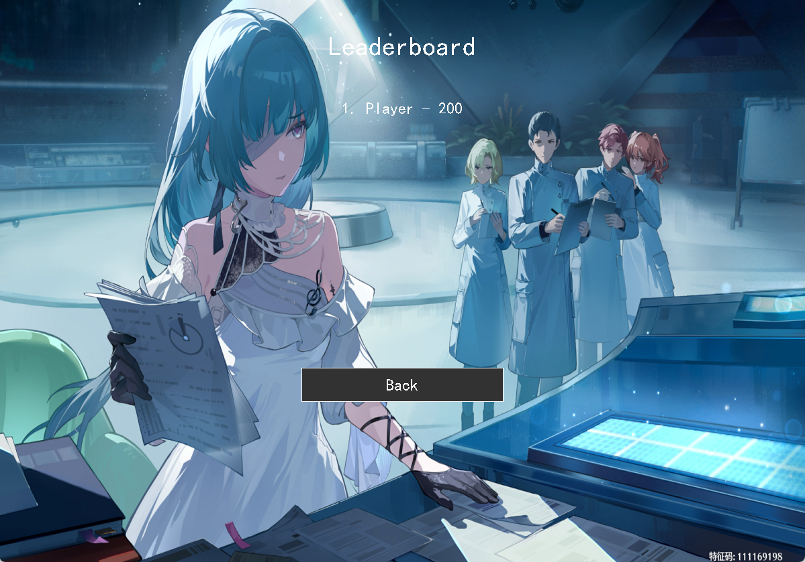

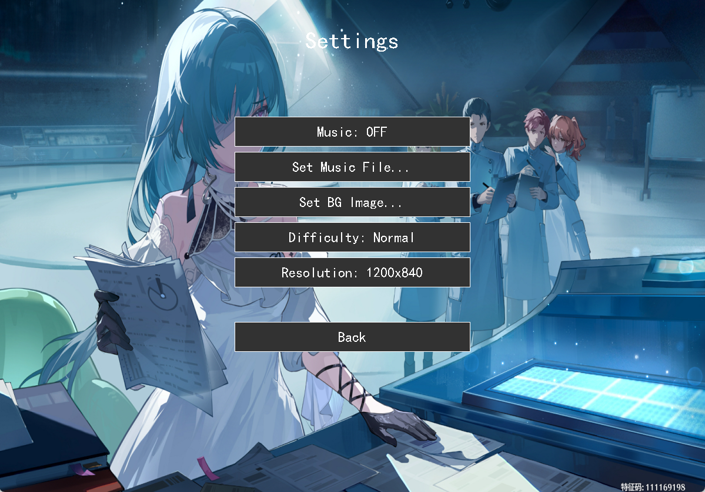

## 第三次问题及改进方向

问题：

- 音乐虽然可以选择，但是还是不可以播放
- 背景图片不可以调整透明度
- PAUSED的提示若在有背景的环境下看不清
- 定义的窗口大小不能匹配背景图的比例

改进方向：

- 选择本地音乐后且Music：ON便可以立即播放
- 背景需要有按钮（Settings）调节不透明度
- Pause的提示框需要跟WIN/Game Over的样式一样
- 游戏窗口需要可以自由拉动调整大小，删除Settings里了窗口大小按钮

经过小组内讨论，我们再次获得以下方案：

**1. 修复音乐播放**

- **问题**：当前音乐路径若包含空格可能导致指令失效，且文件选择后可能未正确重置
- **修复方案**：
  - 修改 `main.c` 中的 `update_music()` 函数，使用 `open "<路径>" type mpegvideo alias BGM` 的指令格式（增加引号和类型指定）
  - 确保在设置菜单选择文件后，立即调用更新函数进行播放

**2. 背景不透明度调节**

- **功能**：在设置界面增加调节背景图亮度的功能
- **实现方案**：
  - **设置项**：利用 `GameSettings` 结构体中的 `bgOpacity` 字段
  - **界面**：将设置菜单原本的“分辨率”按钮替换为“背景亮度”进度条
  - **渲染**：在 `renderer.c` 中实现 `draw_background()` 时，利用 Windows GDI 的 `AlphaBlend` 技术，在背景图之上覆盖一层半透明的黑色遮罩。透明度越低，黑色遮罩越浓，背景越暗

**3. 优化暂停提示可见性**

- **功能**：解决 "PAUSED" 文字在复杂背景下看不清的问题
- **实现方案**：
  - 复用上述的半透明遮罩逻辑，编写 `draw_dim_overlay()` 函数
  - 在 `render_game()` 中绘制暂停状态时，先绘制一个全屏或局部的半透明黑色背景框，再绘制黄色的 "PAUSED" 文字，使其样式与“游戏结束”界面保持一致

**4. 窗口自由拖拽与大小自适应**

- **功能**：移除固定分辨率设置，允许玩家自由拖动窗口边框调整大小
- **实现方案**：
  - **窗口属性**：通过 `SetWindowLong` 为游戏窗口添加 `WS_THICKFRAME`（可调整边框）和 `WS_MAXIMIZEBOX` 属性
  - **动态响应**：在 `main.c` 的主循环中实时检测窗口客户区大小 (`GetClientRect`)
  - **自适应逻辑**：一旦检测到窗口大小改变：
    1. 更新全局宽高变量 `g_windowWidth` 和 `g_windowHeight`
    2. 根据新的窗口高度动态计算方块大小 `g_blockSize`（例如：高度 / 22），确保棋盘完整显示
    3. 调用 `initgraph` 重新调整绘图缓冲区大小，并重新居中所有菜单按钮

修改了窗口大小之后遇到：

**已经可以调整窗口大小，但是界面UI不会自动适应窗口大小，导致窗口调整了但是UI不动**

**问题原因**

在 `main.c` 中，当检测到窗口大小变化时，会调用 `update_window_size()`。这个函数内部会执行 `closegraph()`（销毁窗口）和 `initgraph()`（新建窗口）。然而，`main.c` 主循环中使用的窗口句柄 `hwnd` 仍然指向那个**已经被销毁的旧窗口**。这导致随后的 `GetClientRect(hwnd, ...)` 调用失效，无法再检测到新的大小变化，UI 更新逻辑也就无法触发

**问题**

窗口不断闪烁缩小直至消失

**问题根本原因 (Root Cause)**

当 `initgraph(w, h)` 创建窗口时，它生成的是一个具有标准边框的窗口，其 **客户区 (Client Area)** 大小为 `w` x `h`

接着，我们在 `apply_resize_style` 中通过 `SetWindowLong` 强制添加了 `WS_THICKFRAME`（可调整大小的粗边框）样式

由于我们在 `SetWindowPos` 中使用了 `SWP_NOSIZE`（保持窗口外部尺寸不变），**新增的粗边框会向内挤压，导致客户区变小**

主循环检测到客户区变小（`GetClientRect` 返回值 < `g_windowWidth`），于是再次调用 `initgraph` 使用这个更小的尺寸创建新窗口。新窗口再次被加上粗边框，客户区再次变小。如此循环，导致窗口无限缩小并闪烁，最终消失

**修复方案**

修改 `renderer.c` 中的 `apply_resize_style` 函数。在应用新样式后，我们需要**重新计算并调整窗口的外部尺寸**，以补偿新增边框占用的空间，确保客户区大小始终保持为 `g_windowWidth` x `g_windowHeight`

具体步骤：

1.  获取当前窗口样式，添加 `WS_THICKFRAME` 和 `WS_MAXIMIZEBOX`
2.  使用 `AdjustWindowRect` 函数，根据目标客户区大小 (`g_windowWidth`, `g_windowHeight`) 和新样式，计算出所需的**窗口外部尺寸**
3.  调用 `SetWindowPos` 时，**去掉 `SWP_NOSIZE` 标志**，并传入计算出的新宽度和高度

这样，无论样式如何变化，窗口的客户区都会稳定在预期的尺寸

**成果**：

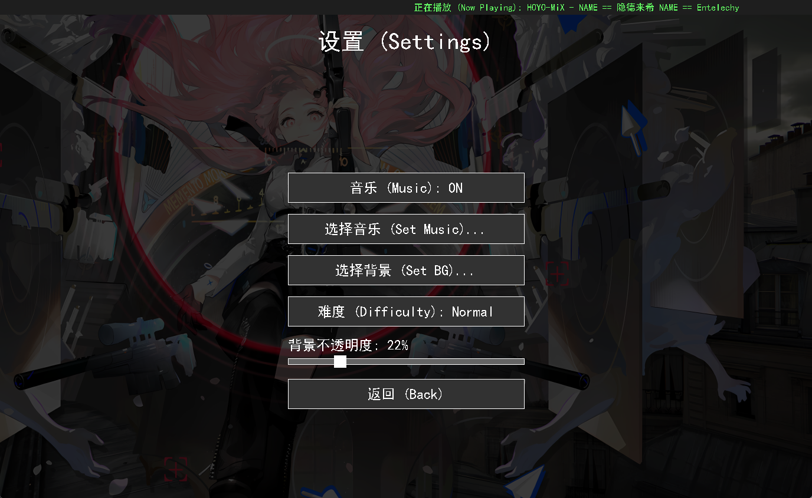

全部成功解决

## 第一次优化方向

**（公测版1.0）**

在前三次问题提出和改进中，我们已经基本完成了所有的功能需求，现在到了优化体验的时候了

我们注意到：

- 单人对战中，消除一行固定获得一百分过于枯燥，应该引入奖励机制
- 没有按键提示，Level不知道怎么调整
- 多人对战中，一分钟过于短暂，需要有选项设置时间

所以经过小组讨论，我们得到了以下优化方案：

- 消除多行时，得到的分数更改为：(行数+1) * 100（2 <= 消除行数 <= 4）
- 单人模式中通过W/S来增加或减少Level（1 <= Level <= 10）
- 多人对战中，开局先给弹窗，选择对战时间（1min，5min，10min，不限时直到一方GameOver）
- 单人对战中，左侧部分显示按键指南

**成果**

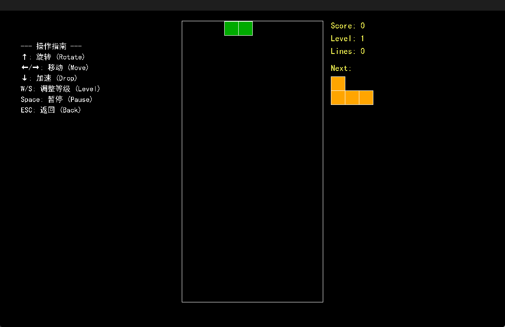

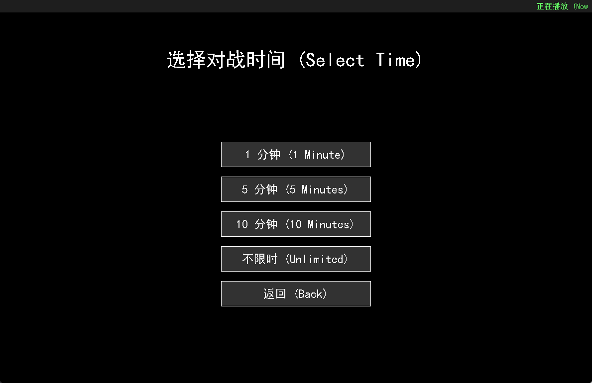

## 第二次优化方向

（公测版1.1）

此次优化目标如下：

- 背景增加缓存机制，即设置了一次之后，每次打开都是之前设置，不必重复设置
- 窗口大小拉动了一次之后，后面打开也是拉动后的，不必重复调整大小
- 新增单人模式下快按两次↓之后物块可以移动到最底层，双人模式下同理

有了以下方案：

**1. 配置文件缓存机制 (Settings & Window Persistence)**

- **目标**：保存背景图片路径、透明度、难度、音乐开关以及**窗口大小**，并在下次启动时自动加载
- **实现**：
  - **配置文件**：使用一个简单的文本文件 `settings.cfg`
  - **数据结构**：在 `common.h` 的 `GameSettings` 结构体中增加 `windowWidth` 和 `windowHeight` 字段
  - **加载/保存**：
    - 在 `main.c` 中实现 `load_settings()` 和 `save_settings()` 函数
    - 启动时调用 `load_settings()`，如果有存档，则使用存档中的窗口大小初始化窗口
    - 退出游戏（或窗口大小/设置改变）时调用 `save_settings()`

**2. 双击快速下落 (Double Tap Hard Drop)**

- **目标**：单人模式和双人模式下，快速连按两次“下”键（或“S”键）直接将方块移动到底部并锁定
- **实现**：
  - **检测逻辑**：在 `input.c` 中，为每个玩家增加“上次按下‘下’键的时间戳”记录
  - **判定**：如果当前按下“下”键的时间与上次按下时间的间隔小于阈值（例如 250ms），则触发 Hard Drop
  - **动作**：调用一个新的 `hard_drop()` 函数（将在 `game_logic.c` 中实现），该函数会循环执行 `move_block(p, 0, 1)` 直到无法移动，然后立即锁定

## 第三次优化方向

（公测1.2）

闪断更新内容如下：

- 暂停界面有继续游戏和重新开始的选项，支持鼠标点击，但是按下Space键依旧可以继续游戏
- 优化手感，使的旋转和移动更加跟手

具体如下：

引入标准的俄罗斯方块输入模型：

-   **DAS (Delayed Auto Shift)**：按下方向键时立即移动一次，按住约 200ms 后才开始连发。这能防止只想移动一格时误触多格
-   **ARR (Auto Repeat Rate)**：进入连发状态后，以极快速度（如 50ms/格）移动，实现丝滑的“滑块”效果

## 第四次优化方向

（公测1.3）

闪断更新内容如下：

- 增加了音乐音量条，这样可以在不用调节系统音量的同时还可以听音乐
- 修复双人对战中长条会挡住画面的问题
- 修复背景不显示的问题

## 第五次优化方向

本次闪断更新如下：

- 设置了音量和不透明度的默认值
- 修复背景图片选择了但是不显示的问题
- 双人对战区域适应窗口大小
- 将背景设置改为了设置默认背景

成果：

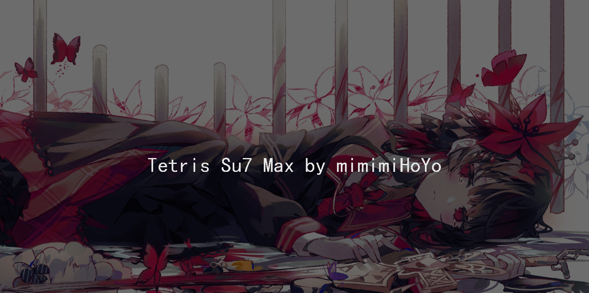

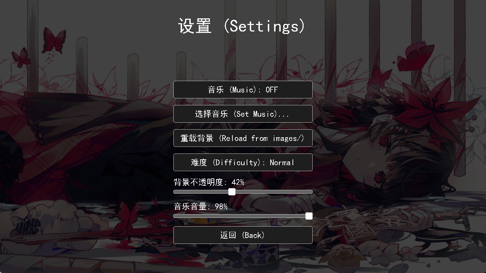

## 关于美化

由于不是那么懂UI，所以就是换了个默认音乐和默认图标，然后作为最后一次自省自查的优化/更新
